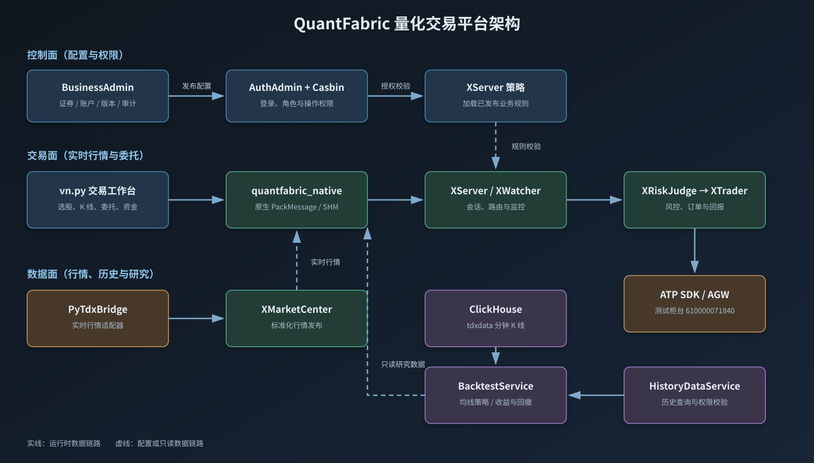
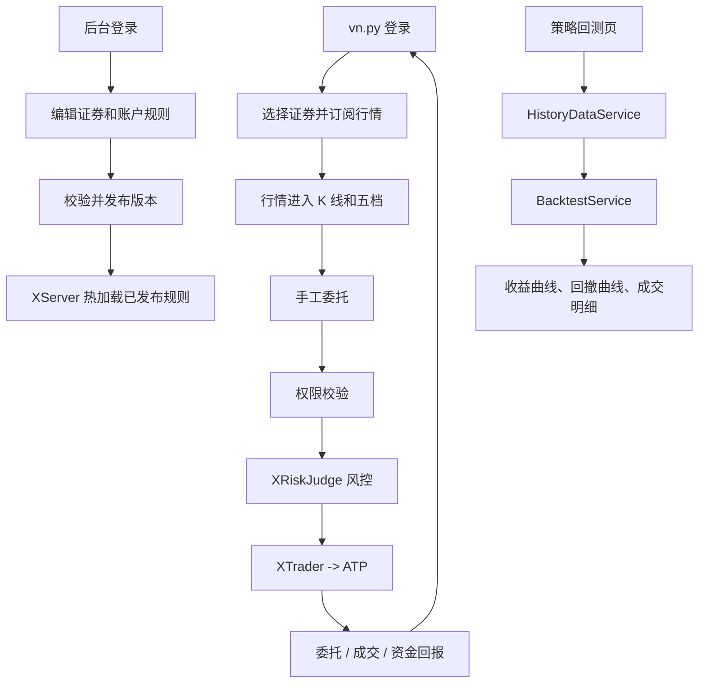

# QuantFabric Trading Platform

QuantFabric 是一个由 C++ 交易核心、vn.py 交易工作台和业务后台组成的量化交易平台。
当前环境使用 PyTdx 实时行情、ClickHouse 历史分钟 K 线和 ATP 测试柜台（账户
`610000071840`）。

## 当前发布版本

这是单仓库（Monorepo）版本：所有交易模块都是主仓库中的普通目录，不再使用 Git 子模块或 fork 链路。为了保证所有开发者拿到完全一致的版本，请使用发布标签克隆：

```bash
git clone --branch v2026.08.18-monorepo-final git@github.com:Weatherbless2/quantfabric-trading-platform.git
cd quantfabric-trading-platform
```

如果只执行不带 `--branch` 的普通 clone，Git 会获取当时 `main` 分支指向的版本；需要复现本次单仓库最终版本时，必须使用上面的 `v2026.08.18-monorepo-final` 标签。

本次导入的模块来源提交如下，提交仅用于追溯来源；代码已经直接纳入主仓库：

| 模块目录 | 导入来源提交 | 用途 |
| --- | --- | --- |
| 根仓库发布标签 | `v2026.08.18-monorepo-final` | 平台总工程和全部模块版本锁定 |
| `XWatcher` | `a2ef0f7c2901b8e2a35e759da209f2b9005206ce` | 监控和交易数据转发 |
| `XServer` | `2f63b78c0e48664fc70a08099d94c871043905d8` | 会话、请求转发和服务端业务编排 |
| `XTrader` | `9ef8b1ac9a59a6582cb3b5764577b3d7e58261dc` | 交易业务处理和 ATP 柜台适配 |
| `XRiskJudge` | `2cd183151fb43ed2fcfef3a0fe46783a24845eb1` | 账户容量、流控、撤单和异常交易风控 |
| `XMonitor` | `d405a4788543677b545b9ca906381836fc77f971` | Qt 交易端监控和授权会话 |
| `XMarketCenter` | `a89128648d26719b9600158bb93054d3dc1dfb5e` | 行情接入和行情服务 |
| `XAPI` | `af0dee1afb0319474ebb9efb136c121b0591b581` | 第三方柜台、网络和基础库 |
| `Utils` | `7685d57cbd11473d7c15c4b9454fdb60b258a4b2` | 公共配置和业务策略支持 |
| `SHMServer` | `227f1e6201e4709967fede1ab4818067112aa52a` | 共享内存通信 |
| `XQuant` | `0eef8ca232538a396de405a21d21d8000d2840b9` | 客户端协议和量化接口 |

上述目录已经是主仓库普通文件，后续修改 `XServer`、`XTrader`、`XRiskJudge` 等模块时，直接在主仓库提交即可。验收时可执行：

```bash
git rev-parse HEAD
git submodule status --recursive
git status --short
```

`git submodule status --recursive` 不应输出任何内容，仓库中也不存在 `.gitmodules`。以后只需要 `git pull`、修改代码、`git add`、`git commit` 和 `git push`，不再需要初始化子模块、同步 fork 或更新 gitlink。

### 配置和敏感信息

- 数据库、行情 SDK、ATP 账号和本地运行配置只应放在本地配置文件中，不提交到 Git。
- `表结构/` 中的解压 SQL 未提交，因为其中包含明文数据库密码；根目录的 `01init_tables.rar` 仅作为初始化原始包保留。
- 使用初始化脚本前，请先检查并替换本机数据库账号、密码和连接地址；不要把新的明文密码提交到仓库。

## 项目模块

| 模块 | 所在层 | 用通俗的话理解 | 主要入口 |
| --- | --- | --- | --- |
| `VnpyMonitor` | 交易前端 | 看行情、看 K 线、查资金持仓、手工下单、运行回测 | `python -m VnpyMonitor.app` |
| `BusinessAdminService` | 业务后台 | 管理证券、产品、资产单元、资金账户、版本和审计 | `http://127.0.0.1:19080/` |
| `AuthAdminService` | 权限中心 | 登录、角色和 Casbin 操作权限 | `http://127.0.0.1:18080/` |
| `XServer` / `XWatcher` | C++ 会话层 | 接收客户端请求、转发消息、监控运行状态 | `runtime/start.sh` |
| `XRiskJudge` | C++ 风控层 | 在订单到柜台前检查账户、证券和风险规则 | `runtime/start.sh` |
| `XTrader` / `ATPBridge` | C++ 交易层 | 把标准订单发给 ATP，并把委托、成交回报带回来 | `runtime/start.sh` |
| `XMarketCenter` / `PyTdxBridge` | C++ 行情层 | 接收实时行情，转换成统一行情消息 | `runtime/start.sh` |
| `HistoryDataService` / `BacktestService` | 数据研究层 | 从 ClickHouse 取历史 K 线，计算收益、回撤和成交 | `18081` / `18082` |

## 一张图看懂架构

## 运行界面




## 一条链路看懂业务



简单理解：后台负责“允许谁交易什么”，交易端负责“看行情和发请求”，C++ 核心负责“校验、
风控和柜台通信”；回测是独立的只读链路，不会触发真实委托。

## 首次安装与构建

在仓库根目录执行一次：

```bash
sudo apt-get update
sudo apt-get install -y build-essential cmake curl sqlite3 python3-dev python3-venv \
  qtbase5-dev qt5-qmake

python3 -m venv .auth-venv
.auth-venv/bin/python -m pip install -r AuthAdminService/requirements.txt
.auth-venv/bin/python -m pip install -r HistoryDataService/requirements.txt
python3 -m venv .vnpy-venv
.vnpy-venv/bin/python -m pip install -r VnpyMonitor/requirements.txt

./runtime/setup-bridges.sh
./runtime/prepare.sh
cmake -S . -B build -DPython3_EXECUTABLE="$PWD/.vnpy-venv/bin/python"
cmake --build build --target \
  XServer_0.9.0 XWatcher_0.6.0 XRiskJudge_0.9.3 XTrader_0.9.3 \
  XMarketCenter_0.9.3 XQuant_0.1.0 QtAdmin_0.1.0 quantfabric_native \
  -j"$(nproc)"
```

## 启动完整项目

先启动 C++ 交易链路（ATP 测试账户，订单权限已开启）：

```bash
./runtime/start.sh
```

看到下面的提示，说明 C++ 主链路已启动：

```text
QuantFabric services are running in real-trade mode.
```

历史行情和回测服务需要本机 ClickHouse 只读配置：

```bash
cp runtime/config/HistoryData.env.example runtime/config/HistoryData.env
# 编辑 HistoryData.env，填写 QF_HISTORY_CLICKHOUSE_USERNAME/PASSWORD
./runtime/start-history-data.sh
./runtime/start-backtest-service.sh
```

启动两个桌面端：

```bash
DISPLAY=:0 .vnpy-venv/bin/python -m VnpyMonitor.app
DISPLAY=:0 ./build/QtAdmin_0.1.0
```

业务后台也可直接用浏览器访问：<http://127.0.0.1:19080/>。
本地开发账号为 `admin / 123456`。

### 启动后看什么

| 页面 | 查看位置 | 能验证的内容 |
| --- | --- | --- |
| 交易工作台 | vn.py 窗口 | 左侧证券列表、实时行情、K 线、五档、资金、持仓、委托、成交 |
| 快速委托 | 交易工作台右侧 | 选择当前证券后填写价格和数量，买入/卖出会经过 C++ 风控 |
| 策略回测 | 交易工作台底部“策略回测” | 选择日期和均线参数，查看收益率、回撤、夏普和成交明细 |
| 证券主数据 | 浏览器 `19080` | 查看版本、证券范围、买入权限、停牌和价格单位 |
| 交易对账 | 后台左侧“交易对账” | 查看 ATP 资金、持仓、委托、成交和重连恢复记录 |

停止全部运行服务：

```bash
./runtime/stop.sh
```

## 常用验证

```bash
curl http://127.0.0.1:18080/healthz   # 权限服务
curl http://127.0.0.1:19080/healthz   # 业务后台
curl http://127.0.0.1:18081/readyz    # 历史行情
curl http://127.0.0.1:18082/readyz    # 回测服务
```

vn.py 的“策略回测”页可选择证券、日期、K 线周期、均线参数和初始资金，展示收益曲线、
回撤曲线、收益率、最大回撤、夏普比率及成交明细。命令行回测示例：

```bash
./runtime/backtest.sh --symbol 600000 --exchange SSE \
  --start 2026-03-11 --end 2026-08-11 --interval 5 --fast 10 --slow 30
```

回测只读取 ClickHouse，不连接 ATP，也不会发送委托。

## 当前边界

- 实时行情：当前为 PyTdx；接入公司行情 SDK 时替换 `XMarketCenter` 适配层。
- 交易：ATP 测试柜台，委托仍经过业务规则、XServer 和 XRiskJudge。
- 配置、数据库、日志、SDK 和账号凭据均为本机文件，不提交 Git。

更多细节见：[运行说明](runtime/README.md)、[后台管理](BusinessAdminService/README.md)、
[历史数据](HistoryDataService/README.md)、[回测服务](BacktestService/README.md)。
