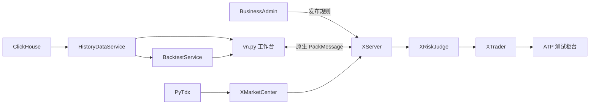

# QuantFabric Trading Platform

QuantFabric 是一个由 C++ 交易核心、vn.py 交易工作台和业务后台组成的量化交易平台。
当前环境使用 PyTdx 实时行情、ClickHouse 历史分钟 K 线和 ATP 测试柜台（账户
`610000071840`）。

## 模块与链路

| 模块 | 作用 |
| --- | --- |
| `VnpyMonitor` | vn.py Qt 交易工作台：行情、K 线、资金、持仓、委托、成交和回测 |
| `BusinessAdminService` | 证券、产品、资金账户、权限、版本发布和审计 |
| `XServer → XRiskJudge → XTrader` | C++ 会话、风控和订单链路 |
| `XMarketCenter` / `PyTdxBridge` | 实时行情接入与发布 |
| `HistoryDataService` / `BacktestService` | ClickHouse 历史数据和只读策略回测 |



## 运行界面


## 首次安装与构建

在仓库根目录执行一次：

```bash
git submodule update --init --recursive
sudo apt-get update
sudo apt-get install -y build-essential cmake curl sqlite3 python3-dev python3-venv \
  qtbase5-dev qt5-qmake

python3 -m venv .auth-venv
.auth-venv/bin/python -m pip install -r AuthAdminService/requirements.txt
.auth-venv/bin/python -m pip install -r HistoryDataService/requirements.txt
python3 -m venv .vnpy-venv
.vnpy-venv/bin/python -m pip install -r VnpyMonitor/requirements.txt

./runtime/setup-bridges.sh
./runtime/prepare.sh
cmake -S . -B build -DPython3_EXECUTABLE="$PWD/.vnpy-venv/bin/python"
cmake --build build --target \
  XServer_0.9.0 XWatcher_0.6.0 XRiskJudge_0.9.3 XTrader_0.9.3 \
  XMarketCenter_0.9.3 XQuant_0.1.0 QtAdmin_0.1.0 quantfabric_native \
  -j"$(nproc)"
```

## 启动完整项目

先启动 C++ 交易链路（ATP 测试账户，订单权限已开启）：

```bash
./runtime/start.sh
```

历史行情和回测服务需要本机 ClickHouse 只读配置：

```bash
cp runtime/config/HistoryData.env.example runtime/config/HistoryData.env
# 编辑 HistoryData.env，填写 QF_HISTORY_CLICKHOUSE_USERNAME/PASSWORD
./runtime/start-history-data.sh
./runtime/start-backtest-service.sh
```

启动两个桌面端：

```bash
DISPLAY=:0 .vnpy-venv/bin/python -m VnpyMonitor.app
DISPLAY=:0 ./build/QtAdmin_0.1.0
```

业务后台也可直接用浏览器访问：<http://127.0.0.1:19080/>。
本地开发账号为 `admin / 123456`。

停止全部运行服务：

```bash
./runtime/stop.sh
```

## 常用验证

```bash
curl http://127.0.0.1:18080/healthz   # 权限服务
curl http://127.0.0.1:19080/healthz   # 业务后台
curl http://127.0.0.1:18081/readyz    # 历史行情
curl http://127.0.0.1:18082/readyz    # 回测服务
```

vn.py 的“策略回测”页可选择证券、日期、K 线周期、均线参数和初始资金，展示收益曲线、
回撤曲线、收益率、最大回撤、夏普比率及成交明细。命令行回测示例：

```bash
./runtime/backtest.sh --symbol 600000 --exchange SSE \
  --start 2026-03-11 --end 2026-08-11 --interval 5 --fast 10 --slow 30
```

回测只读取 ClickHouse，不连接 ATP，也不会发送委托。

## 当前边界

- 实时行情：当前为 PyTdx；接入公司行情 SDK 时替换 `XMarketCenter` 适配层。
- 交易：ATP 测试柜台，委托仍经过业务规则、XServer 和 XRiskJudge。
- 配置、数据库、日志、SDK 和账号凭据均为本机文件，不提交 Git。

更多细节见：[运行说明](runtime/README.md)、[后台管理](BusinessAdminService/README.md)、
[历史数据](HistoryDataService/README.md)、[回测服务](BacktestService/README.md)。
