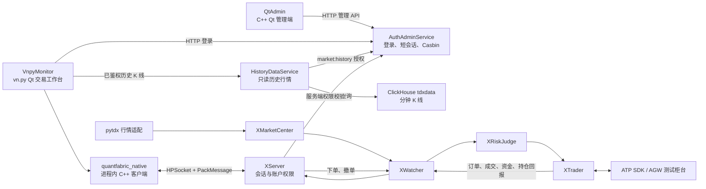
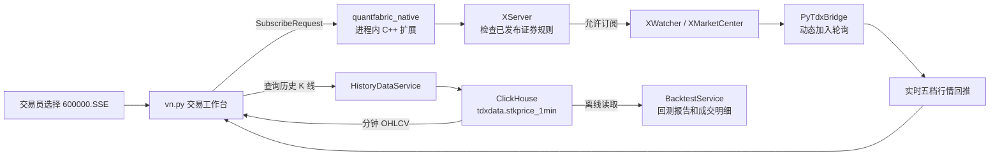

# QuantFabric Trading Platform

基于 QuantFabric 的 C++ Qt 量化交易平台学习与协作仓库。

当前目标是构建一个本地部署的桌面交易平台：vn.py Qt 工作台通过进程内
`quantfabric_native` C++ 扩展直接连接 QuantFabric C++ 交易核心。该扩展不是
独立桥接进程，Python 不会绕过 XServer、XRiskJudge 或 XTrader 直连柜台。

> 当前仓库连接 ATP 测试柜台账户 `610000071840`。它不是生产账户；所有委托仍须经过
> 权限、后台发布规则、XServer、XRiskJudge 和 ATP 柜台校验。

## 当前进度（2026-08-14）

当前处于“ATP 测试柜台交易闭环 + 第一版业务控制面”阶段，尚未进入生产柜台上线阶段。

| 阶段 | 状态 | 已交付内容 |
|---|---|---|
| 1. C++ 核心交易面 | 已完成 | `XServer -> XWatcher -> XRiskJudge -> XTrader -> ATP SDK -> AGW`，共享内存行情、资金、持仓、委托和成交链路。 |
| 2. 认证与权限控制面 | 已完成 | `AuthAdminService`、短会话、Casbin、菜单与账户动作授权、审计。 |
| 3. vn.py 交易桌面 | 已完成 | `VnpyMonitor`、实时行情、ClickHouse 全量分钟 K 线、资金、持仓、委托、成交、下单和撤单入口。 |
| 4. 业务后台管理 | 已完成第一版 | `BusinessAdminService` 的主数据、资产单元、账户关联、草稿、校验、发布、退役和审计。 |
| 5. 控制面与交易面联调 | 已完成 | XServer 只加载 `PUBLISHED` 版本，支持原子热更新，并校验订阅、下单和撤单规则。 |
| 6. 公司行情与生产柜台 | 进行中 | ATP 测试柜台已完成 SDK/AGW 登录及查询验收；仍缺公司实时行情 SDK/字段映射、断线恢复压测和生产风控验收。 |

已确认：vn.py 通过进程内 `quantfabric_native` C++ 扩展使用 HPSocket + PackMessage
连接 XServer；不存在桌面端 Python/C++ 桥接进程。Redis、Keycloak、复杂审批流、多租户，
以及绕过交易核心的客户端柜台访问不在当前范围。

## 目标架构



完整职责、数据流和实现顺序见
[目标架构文档](doc/architecture/TargetArchitecture.md)。

## 运行界面

### vn.py 交易工作台

交易工作台展示全量证券列表、实时五档行情、ClickHouse 历史 K 线、资金持仓和限价下单入口。
截图来自 ATP 测试柜台联调运行，不代表生产交易。


### SQL 业务字段后台

BusinessAdminService 是基于 market、fundinfo、projectacct、fundacct、fundacctlink 和
stkinfo 等 SQL 表业务含义建立的版本化控制面。下图为已发布版本 13 的证券主数据页：
当前包含 5,205 只可用证券，并展示市场代码、证券代码、买入权限、最小价格单位和停牌状态；
“一键切换买入并发布”会创建并审计新版本，不会直接改写当前版本。


## 首次构建

以下命令在 WSL Ubuntu 的仓库根目录执行：

```bash
git submodule update --init --recursive

sudo apt-get update
sudo apt-get install -y build-essential cmake curl sqlite3 python3-dev python3-venv \
    qtbase5-dev qt5-qmake

python3 -m venv .auth-venv
.auth-venv/bin/python -m pip install -r AuthAdminService/requirements.txt
python3 -m venv .vnpy-venv
.vnpy-venv/bin/python -m pip install -r VnpyMonitor/requirements.txt
.auth-venv/bin/python -m pip install -r HistoryDataService/requirements.txt

./runtime/setup-bridges.sh
./runtime/prepare.sh

cmake -S . -B build -DPython3_EXECUTABLE="$PWD/.vnpy-venv/bin/python"
cmake --build build --target \
    XServer_0.9.0 XWatcher_0.6.0 XRiskJudge_0.9.3 XTrader_0.9.3 \
    XMarketCenter_0.9.3 XQuant_0.1.0 QtAdmin_0.1.0 quantfabric_native \
    -j"$(nproc)"
```

## 运行与验收

### 1. 启动完整本地联调链路

首次执行“首次构建”后，配置业务策略并启动全部服务：

```bash
./runtime/prepare.sh

cat >> runtime/config/BusinessAdmin.env <<'EOF'
QF_BUSINESS_POLICY_ENABLED=true
QF_BUSINESS_POLICY_URL=http://127.0.0.1:19080
QF_BUSINESS_POLICY_TIMEOUT_MS=1000
QF_BUSINESS_POLICY_REFRESH_SECONDS=5
EOF

./runtime/prepare.sh
./runtime/start.sh
```

`start.sh` 会按以下顺序启动：`AuthAdminService -> BusinessAdminService -> XServer ->
XWatcher -> XRiskJudge -> XTrader -> XMarketCenter -> XQuant`。当业务策略开启时，脚本
会在 XServer 前等待后台服务就绪，避免 XServer 因找不到已发布配置而进入 fail-closed。

验证所有核心服务和已发布配置：

```bash
curl http://127.0.0.1:18080/healthz
curl http://127.0.0.1:19080/healthz
grep -a 'activated published business policy version' runtime/log/XServer_*.log | tail -1
```

预期结果是两个 HTTP 请求分别返回 `status: ok`，日志出现
`XServer activated published business policy version:<n>`。

### 2. 打开两个页面

在 Windows 浏览器地址栏访问后台管理页面：

```text
http://127.0.0.1:19080/
```

WSL 环境不需要、也通常没有安装 `xdg-open`；该命令缺失不影响后台服务运行。

在另一新终端打开 vn.py 交易客户端：

```bash
DISPLAY=:0 .vnpy-venv/bin/python -m VnpyMonitor.app
```

开发登录账号为 `admin`，密码为 `123456`。后台页面用于维护并发布配置版本；交易客户端
用于订阅行情、查看 K 线/资金/持仓/委托/成交，以及发起测试下单。`XMonitor` 是旧 Fabric
监控界面，不是当前交易前端。

### 3. 验证后台发布会影响交易

1. 在后台页面的“证券主数据”中选中 `300007`，点击“一键切换买入并发布”并确认。
2. 等待不超过 `QF_BUSINESS_POLICY_REFRESH_SECONDS` 秒。
3. 在交易客户端对 `300007.SZSE` 发起 100 股限价买单：关闭“允许买入”时会被 XServer
   拒绝；重新启用并发布后，同样的订单会通过 `XRiskJudge -> ATPTrader -> ATP SDK` 进入测试柜台。

这证明使用链路为：`后台发布 -> BusinessAdminService -> XServer 热加载 -> vn.py 下单
-> 风控 -> ATPTrader -> ATP SDK -> AGW 回报`，而非前端本地放行。

一键操作仍会在服务端复制当前已发布版本、只修改所选证券、校验并发布新版本，同时写入审计；
它不会直接改写运行中的版本，也不会改变其他证券规则。

### 4. 可选页面和历史行情

后台服务启动后，也可使用 Qt 权限管理端：

```bash
# 权限管理端
./build/QtAdmin_0.1.0
```

若已按 [HistoryDataService/README.md](HistoryDataService/README.md) 配置服务器上
`tdxdata` ClickHouse 的只读账号并启动历史服务，在本机额外设置其地址后启动工作台：

```bash
cp runtime/config/HistoryData.env.example runtime/config/HistoryData.env
# 编辑 HistoryData.env，填写本机保存的 ClickHouse 只读账号和密码。
./runtime/start-history-data.sh
export QF_HISTORY_URL=http://127.0.0.1:18081
DISPLAY=:0 .vnpy-venv/bin/python -m VnpyMonitor.app
```

未设置 `QF_HISTORY_URL` 时，工作台仅绘制本次运行以来的实时 K 线，不会尝试连接
历史服务，也不会影响订阅、风控或交易。历史服务对 ClickHouse 的表编码通过环境变量适配；
未来公司行情接口接入时，实时行情替换 `XMarketCenter` 插件，历史数据实现相同 OHLCV
接口即可，vn.py、XServer、风控和柜台链路不需要改动。

后台管理页面的“行情库状态”不直接连接 ClickHouse，而是通过 `HistoryDataService` 的内部
汇总接口读取行数和时间范围，因此 ClickHouse 凭据只留在历史服务的本机配置中。

标准运行入口连接 pytdx 实时行情和 ATP 测试柜台。权限后台的实际操作方式见
[VnpyMonitor/README.md](VnpyMonitor/README.md)。

停止服务：

```bash
./runtime/stop.sh
```

`runtime/prepare.sh` 生成的数据库、日志、PID 和 `AuthAdmin.env` 都是本机运行状态，
不能提交到 Git。

## 业务控制面与已发布运行策略

`BusinessAdminService/` 是独立的 Python 控制面，负责主数据、账户关联、版本校验、发布和
审计；它不写入实时订单、成交、资金或持仓。PostgreSQL 迁移位于
`BusinessAdminService/migrations/postgresql/`，先执行 001、002、003，再设置
`QF_BUSINESS_DATABASE_URL` 启动服务。开发环境默认使用运行目录中的 SQLite。

只有 `PUBLISHED` 版本会被 C++ `XServer` 读取。业务策略开关由本机
`runtime/config/BusinessAdmin.env` 统一管理；开启后 `runtime/start.sh` 会先启动
`BusinessAdminService`，再启动 XServer。首次启用时按“运行与验收”章节写入开关并执行
`./runtime/prepare.sh`。不要同时手工启动重复的 19080/19081 后台实例。

```bash
./runtime/start.sh
```

启用前必须在后台发布与 ATPTrader 匹配的 `ATPTest / 610000071840` 产品、账户关联和证券规则。验证策略
加载与回退：查看 `runtime/log/XServer_*.log` 中的版本激活/刷新告警，并运行：

```bash
.auth-venv/bin/python -m unittest BusinessAdminService.test_service
cmake --build build --target XServerRuntimePolicyTest -j"$(nproc)"
./build/XServerRuntimePolicyTest
```

控制面暂时不可用时，XServer 保留上一次完整加载的策略；首次加载失败则对订阅、下单和撤单
采取 fail-closed。撤单通过 XServer 从订单回报建立的 `OrderRef` 索引取得证券上下文，继续
执行已发布版本的 `cancel_allowed`，不改变现有 `PackMessage` 协议。

最近一次完整验证覆盖：后台 API 和 Casbin、ClickHouse 历史服务、vn.py 历史接口契约、
C++ 运行时策略解析、完整启动、策略禁买拒单以及 ATP SDK/AGW 登录与柜台查询。历史服务
已用 `tdxdata.stkprice_1min` 的真实 `SZSE:000001` 数据验收 5 分钟 K 线。XServer 同时已
加入空闲队列退避，避免没有业务消息时占满一个 CPU 核；兼容登录表的密码和失败登录密码不会
写入日志。

更完整的运行说明见 [runtime/README.md](runtime/README.md)。

### CK 历史回测

CK 历史数据用于独立回测，不连接 ATP，也不会发送真实委托。当前环境可直接运行：

```bash
./runtime/backtest.sh --symbol 300007 --exchange SZSE \
  --start 2026-03-11 --end 2026-08-11 --interval 5 --fast 10 --slow 30
```

报告和成交明细写入 `runtime/data/backtest/`。CK 中有历史数据只表示该标的可以回测或展示；
能否进入实时订阅、风控和 ATP 交易，仍由 BusinessAdmin 已发布证券规则决定。

### 当前 A 股证券范围同步

`PyTdxBridge` 会保存当前沪深 A 股主数据，CK 用于确认这些标的至少存在一分钟历史数据。以下命令
创建一个可审计的新草稿版本，替换证券规则、校验并发布；不会发送 ATP 委托：

```bash
./runtime/sync-ck-security-master.sh
```

本次运行发布了 `5,205` 只 PyTdx 当前 A 股与 CK 数据的交集。同步后，XServer 在刷新周期内热加载
新版本；PyTdx 行情仍是用户选择标的后按需订阅，不会在启动时轮询全市场。CK 中的历史退市代码和
尚未出现历史数据的新上市代码不会被自动开放交易。

### 全市场标的、实时行情与回测

`300007.SZSE` 是交易工作台启动时的默认展示标的，并不是证券范围白名单。左侧“行情列表”加载
PyTdx 证券主数据；在搜索框输入代码或名称并单击任意证券后，工作台会切换行情、K 线和下单面板，
再向 C++ 原生会话发起该标的的实时订阅。这样可以覆盖发布版本内的证券，同时不会在启动时对五千多只
标的进行无意义轮询。



使用范围应区分如下：

| 场景 | 范围 | 行为 |
|---|---|---|
| 左侧浏览与搜索 | 当前 PyTdx 证券主数据 | 可查看全部已同步证券。 |
| 实时行情 | 已发布业务策略允许的证券 | 单击后按需订阅；不在启动时全量订阅。 |
| 手工下单和撤单 | 已发布规则、账户权限和 ATP 测试柜台共同允许的证券 | 仍依次经过 XServer、风控和柜台校验。 |
| CK 历史 K 线和回测 | `tdxdata.stkprice_1min` 中存在数据的证券 | 不连接 ATP，不会产生委托。 |

例如，以下命令已验证 `600000.SSE` 可以从 CK 读取 5 分钟 K 线并完成独立回测：

```bash
./runtime/backtest.sh --symbol 600000 --exchange SSE \
  --start 2026-03-11 --end 2026-08-11 --interval 5 --fast 10 --slow 30
```

报告写入 `runtime/data/backtest/`。同步命令会以“当前 PyTdx 主数据与 CK 历史数据交集”创建新
发布版本；因此新增标的需要先在两个数据源中均可用，再运行同步命令，才会进入实时订阅和交易策略范围。

## 团队协作

- `main`：稳定架构基线，只通过 Pull Request 合并。
- `feature/...`：每个功能独立开发，例如 `feature/qt-admin`、
  `feature/qt-trader-session`。
- 提交前只暂存明确文件，禁止将本机 SDK、账户配置、数据库、日志或构建产物上传。
- 每个 Pull Request 应包含功能说明、验证方式和不包含的内容，并由 mentor 审核。

## 目录概览

| 目录 | 作用 |
|---|---|
| `AuthAdminService/` | Python 权限服务：登录、短会话、菜单与账户授权、Casbin |
| `XServer/` | C++ 客户端协议入口、会话和账户动作校验 |
| `XWatcher/` | C++ 核心消息转发与监控 |
| `XRiskJudge/` | C++ 交易风控 |
| `XTrader/` | C++ 柜台交易接入 |
| `XMarketCenter/` | C++ 行情接入与分发 |
| `VnpyMonitor/` | vn.py Qt 交易工作台和网关事件映射 |
| `HistoryDataService/` | 历史 K 线只读 API、Casbin 校验和 ClickHouse 映射 |
| `VnpyNative/` | 连接 XServer 的进程内 C++ Python 扩展 |
| `QtAdmin/` | C++ Qt 权限管理端 |
| `runtime/` | 本地准备、启动、停止脚本与示例配置 |
| `doc/architecture/` | 当前和目标架构文档 |
