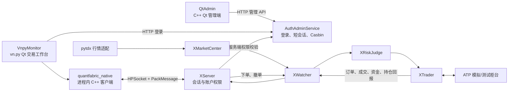

# QuantFabric Trading Platform

基于 QuantFabric 的 C++ Qt 量化交易平台学习与协作仓库。

当前目标是构建一个本地部署的桌面交易平台：vn.py Qt 工作台通过进程内
`quantfabric_native` C++ 扩展直接连接 QuantFabric C++ 交易核心。该扩展不是
独立桥接进程，Python 不会绕过 XServer、XRiskJudge 或 XTrader 直连柜台。

> 当前仓库用于学习、开发和 ATP 模拟/测试柜台验证。未完成风控、账户授权和柜台
> 配置审核前，禁止用于真实交易。

## 当前进度

- 已有：QuantFabric C++ 核心、XServer、XWatcher、XRiskJudge、XTrader、
  XMarketCenter、AuthAdminService、Casbin 权限校验。
- 已有：`VnpyMonitor` vn.py Qt 工作台、`quantfabric_native` 进程内 C++ 客户端和
  `QtAdmin` C++ Qt 权限管理端。
- 已确定：vn.py 通过原生扩展使用 HPSocket + PackMessage 连接 XServer；不存在
  桌面端 Python/C++ 桥接进程。
- 不在当前范围：Redis、Keycloak、复杂审批流、多租户，以及绕过交易核心的客户端柜台访问。

## 目标架构



完整职责、数据流和实现顺序见
[目标架构文档](doc/architecture/TargetArchitecture.md)。

## 首次构建

以下命令在 WSL Ubuntu 的仓库根目录执行：

```bash
git submodule update --init --recursive

sudo apt-get update
sudo apt-get install -y build-essential cmake curl sqlite3 python3-dev python3-venv \
    qtbase5-dev qt5-qmake

python3 -m venv .auth-venv
.auth-venv/bin/python -m pip install -r AuthAdminService/requirements.txt
python3 -m venv .vnpy-venv
.vnpy-venv/bin/python -m pip install -r VnpyMonitor/requirements.txt

./runtime/setup-bridges.sh
./runtime/prepare.sh

cmake -S . -B build -DPython3_EXECUTABLE="$PWD/.vnpy-venv/bin/python"
cmake --build build --target \
    XServer_0.9.0 XWatcher_0.6.0 XRiskJudge_0.9.3 XTrader_0.9.3 \
    XMarketCenter_0.9.3 XQuant_0.1.0 QtAdmin_0.1.0 quantfabric_native \
    -j"$(nproc)"
```

## 本地测试运行

先启动安全的本地测试链路：

```bash
./runtime/start.sh test
```

后台服务启动后，在其他终端运行：

```bash
# 权限管理端
./build/QtAdmin_0.1.0

# 当前交易前端：vn.py Qt 工作台
DISPLAY=:0 .vnpy-venv/bin/python -m VnpyMonitor.app
```

开发登录使用 `admin` / `123456`，权限服务地址为
`http://127.0.0.1:18080`。`XMonitor/build/QtTrader_0.1.0` 是历史 Fabric
监控界面，不是当前 vn.py 交易前端。

`test` 是本地 A 股模拟链路：从证券库选择股票后，模拟行情经 XMarketCenter 按需生成；
手工委托经过 XServer、XRiskJudge 与 TestTrader 后返回模拟成交、资金和持仓。它不连接
pytdx、ATP 或真实柜台。权限后台的实际操作方式见
[VnpyMonitor/README.md](VnpyMonitor/README.md)。

停止服务：

```bash
./runtime/stop.sh
```

`runtime/prepare.sh` 生成的数据库、日志、PID 和 `AuthAdmin.env` 都是本机运行状态，
不能提交到 Git。

更完整的运行说明见 [runtime/README.md](runtime/README.md)。

## 团队协作

- `main`：稳定架构基线，只通过 Pull Request 合并。
- `feature/...`：每个功能独立开发，例如 `feature/qt-admin`、
  `feature/qt-trader-session`。
- 提交前只暂存明确文件，禁止将本机 SDK、账户配置、数据库、日志或构建产物上传。
- 每个 Pull Request 应包含功能说明、验证方式和不包含的内容，并由 mentor 审核。

## 目录概览

| 目录 | 作用 |
|---|---|
| `AuthAdminService/` | Python 权限服务：登录、短会话、菜单与账户授权、Casbin |
| `XServer/` | C++ 客户端协议入口、会话和账户动作校验 |
| `XWatcher/` | C++ 核心消息转发与监控 |
| `XRiskJudge/` | C++ 交易风控 |
| `XTrader/` | C++ 柜台交易接入 |
| `XMarketCenter/` | C++ 行情接入与分发 |
| `VnpyMonitor/` | vn.py Qt 交易工作台和网关事件映射 |
| `VnpyNative/` | 连接 XServer 的进程内 C++ Python 扩展 |
| `QtAdmin/` | C++ Qt 权限管理端 |
| `runtime/` | 本地准备、启动、停止脚本与示例配置 |
| `doc/architecture/` | 当前和目标架构文档 |
