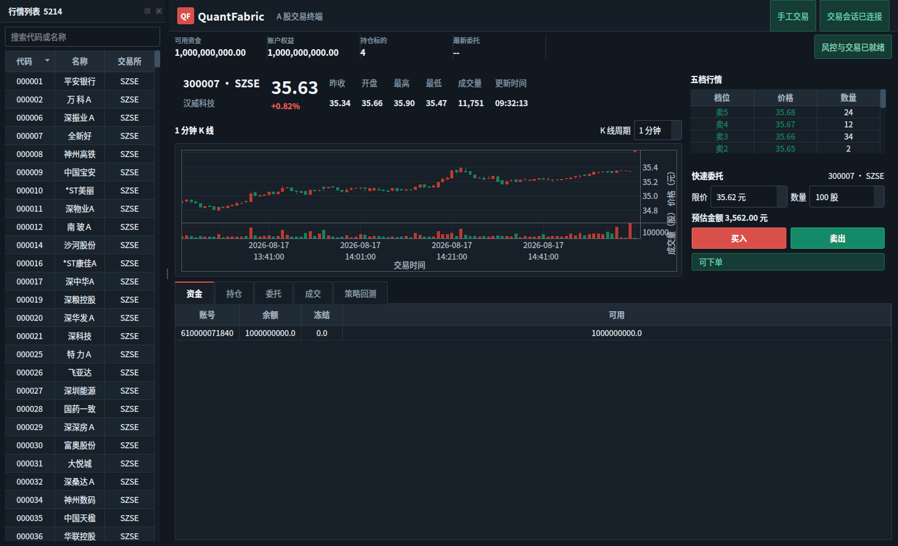
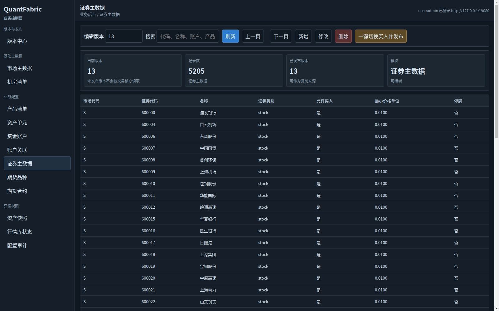

# QuantFabric Trading Platform

本仓库包含两个协同运行的系统：

- 交易系统：vn.py Qt 工作台通过进程内 quantfabric_native C++ 扩展连接
  XServer、XRiskJudge、XTrader 和 ATP 测试柜台。
- 后台管理系统：BusinessAdminService 管理市场、产品、资产单元、资金账户、证券主数据、
  版本发布和审计；C++ 核心只读取已发布版本。

当前使用 PyTdx 实时行情、ClickHouse 历史分钟 K 线和 ATP 测试柜台。公司实时行情 SDK 尚未接入。

## 运行界面

### 交易工作台

交易端提供证券搜索、按需订阅、五档行情、K 线、资金、持仓、委托、成交和测试下单入口。

### SQL 业务字段后台

后台按 market、fundinfo、projectacct、fundacct、fundacctlink 和 stkinfo 等 SQL 表的业务含义
建模。截图展示已发布版本 13 的 5,205 只证券，以及买入权限、最小价格单位和停牌字段。

## 架构

~~~mermaid
flowchart LR
    Admin[BusinessAdminService] -->|发布配置| XServer
    Vnpy[vn.py 交易工作台] --> Native[quantfabric_native]
    Native <--> XServer
    PyTdx[PyTdx 实时行情] --> Market[XMarketCenter] --> Watcher[XWatcher]
    XServer --> Watcher --> Risk[XRiskJudge] --> Trader[XTrader]
    Trader <--> ATP[ATP SDK / AGW 测试柜台]
    ClickHouse[ClickHouse 分钟K线] --> History[HistoryDataService] --> Vnpy
~~~

## 首次构建

在 WSL Ubuntu 仓库根目录执行一次：

~~~bash
git submodule update --init --recursive
sudo apt-get update
sudo apt-get install -y build-essential cmake curl sqlite3 python3-dev python3-venv qtbase5-dev qt5-qmake

python3 -m venv .auth-venv
.auth-venv/bin/python -m pip install -r AuthAdminService/requirements.txt
.auth-venv/bin/python -m pip install -r HistoryDataService/requirements.txt
python3 -m venv .vnpy-venv
.vnpy-venv/bin/python -m pip install -r VnpyMonitor/requirements.txt

./runtime/setup-bridges.sh
./runtime/prepare.sh
cmake -S . -B build -DPython3_EXECUTABLE="$PWD/.vnpy-venv/bin/python"
cmake --build build --target XServer_0.9.0 XWatcher_0.6.0 XRiskJudge_0.9.3 XTrader_0.9.3 XMarketCenter_0.9.3 XQuant_0.1.0 QtAdmin_0.1.0 quantfabric_native -j"$(nproc)"
~~~

## 启动

### 完整交易系统

~~~bash
./runtime/prepare.sh
./runtime/start.sh
DISPLAY=:0 .vnpy-venv/bin/python -m VnpyMonitor.app
~~~

start.sh 会启动权限后台、业务后台、ATP、PyTdx、C++ 行情、风控、交易和策略服务。
交易客户端登录后可从左侧选择证券；实时行情按需订阅，不会启动时全量轮询。

### 单独后台管理系统

~~~bash
./runtime/prepare.sh
./runtime/start-business-admin.sh
~~~

浏览器打开 http://127.0.0.1:19080/。开发账号为 admin，密码为 123456。
后台的证券主数据页可使用“一键切换买入并发布”：服务端复制当前版本、修改单个证券、
校验后发布，同时写入审计。

### 历史 K 线与回测

配置本机只读 ClickHouse 凭据后启动历史服务：

~~~bash
cp runtime/config/HistoryData.env.example runtime/config/HistoryData.env
./runtime/start-history-data.sh
export QF_HISTORY_URL=http://127.0.0.1:18081
~~~

`QF_HISTORY_URL` 只对当前终端及其子进程生效，因此需要在同一个终端中再启动交易客户端：

~~~bash
DISPLAY=:0 .vnpy-venv/bin/python -m VnpyMonitor.app
~~~

回测只读取历史数据，不会连接 ATP 或发送委托：

~~~bash
./runtime/backtest.sh --symbol 600000 --exchange SSE --start 2026-03-11 --end 2026-08-11 --interval 5 --fast 10 --slow 30
~~~

停止完整链路：

~~~bash
./runtime/stop.sh
~~~

## 联调说明

后台发布证券规则后，XServer 会在刷新周期内热加载。交易端下单始终经过
XServer -> XWatcher -> XRiskJudge -> XTrader -> ATP SDK。关闭某证券的买入权限后，
该证券买单会被 XServer 拒绝；其他已发布证券规则不受影响。

当前证券范围由 PyTdx 主数据与 ClickHouse 历史数据交集生成：

~~~bash
./runtime/sync-ck-security-master.sh
~~~

该命令只发布证券配置，不发送 ATP 委托。

## 当前边界

- 实时行情：PyTdx；接入公司 SDK 时替换 XMarketCenter 行情适配层。
- 历史数据：ClickHouse tdxdata.stkprice_1min。
- 交易柜台：ATP 测试账户；生产柜台、公司行情字段映射和断线恢复压测尚未完成。
- 运行配置、数据库、日志、SDK 与账户凭据均为本机文件，不提交 Git。

## 相关文档

- [运行脚本说明](runtime/README.md)
- [后台管理系统](BusinessAdminService/README.md)
- [历史数据服务](HistoryDataService/README.md)
- [回测服务](BacktestService/README.md)
- [目标架构](doc/architecture/TargetArchitecture.md)
