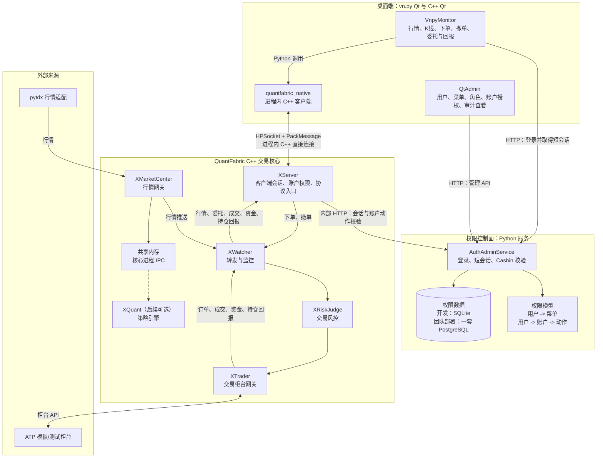

# 目标架构：vn.py Qt 通过原生 C++ 客户端接入交易核心

本文件是项目后续实现的唯一目标架构说明。它遵循当前范围：vn.py Qt 交易端、C++ Qt 管理端、简单的用户/菜单/账户权限、Casbin 鉴权，以及不使用 Redis 的本地部署。

## 架构边界

> 架构图版本说明：附件中的规划图把交易桌面端命名为 C++ Qt 的 `QtTrader`。当前仓库
> 已实现的是 `VnpyMonitor`（vn.py Qt）加进程内 `quantfabric_native` C++ 客户端；它与
> 规划图使用相同的 `HPSocket + PackMessage -> XServer` 边界，但不是 C++ Qt QtTrader。
> `QtAdmin` 已是 C++ Qt。若最终交付必须严格采用图中的 C++ Qt QtTrader，需要单独
> 立项迁移桌面展示层，不能把当前 vn.py 实现误称为已完成该迁移。

| 区域 | 责任 | 不能做的事 |
|---|---|---|
| `VnpyMonitor` | 展示行情与交易状态，发起订阅、下单和撤单 | 不直接访问数据库，不绕过 XServer，不自行放行订单 |
| `QtAdmin` | 管理用户、菜单、角色、账户授权，查看审计记录 | 不连接交易柜台，不直接改风控状态 |
| `AuthAdminService` | 校验用户名密码，签发短会话，执行 Casbin 与账户授权判断 | 不处理行情，不保存交易状态，不替代交易风控 |
| `XServer` | 接收原生 C++ 客户端协议，验证会话和账户权限，转发核心事件 | 不承载桌面界面逻辑，不直接操作 PostgreSQL 业务表 |
| `XWatcher`、`XRiskJudge`、`XTrader` | 交易路由、风险检查、柜台接入与交易回报 | 不信任客户端传来的“已授权”结论 |
| `XMarketCenter` | 接收外部行情并向核心和客户端分发 | 不允许把行情线程阻塞在 Qt 或数据库操作上 |

## 三条关键流程

### 1. 登录与权限

1. VnpyMonitor 或 QtAdmin 向 AuthAdminService 提交账号和密码。
2. AuthAdminService 查询用户、菜单、账户授权和 Casbin 规则，返回可用菜单、可操作账户与短会话 ID。
3. VnpyMonitor 将短会话 ID 传给进程内 `quantfabric_native`，后者通过 PackMessage 登录 XServer。
4. XServer 在订阅、下单、撤单和读取账户数据时，向 AuthAdminService 进行服务端校验。

客户端得到会话 ID 不代表永久授权。关键交易动作必须由 XServer 再次校验。

### 2. 行情

`pytdx -> XMarketCenter -> XWatcher -> XServer -> quantfabric_native -> VnpyMonitor`

XMarketCenter 同时可将行情写入共享内存，供后续的 XQuant 使用。策略引擎不属于当前第一阶段交付范围。

### 3. 下单与回报

`VnpyMonitor -> quantfabric_native -> XServer -> XWatcher -> XRiskJudge -> XTrader -> ATP`

订单、成交、资金和持仓回报沿 `XTrader -> XWatcher -> XServer -> quantfabric_native -> VnpyMonitor` 返回。前端只能展示状态，不能把“已成交”或“已撤单”写死在界面上。

## 当前不做

- 不保留桌面端 Python/C++ 中间进程；`quantfabric_native` 是进程内绑定，不是桥接服务。
- 不让 vn.py GUI 绕过 XServer、XRiskJudge 或 XTrader 直接访问柜台。
- 不使用 Redis、Keycloak、审批流、多租户和复杂的权限树。
- 不让桌面客户端直连 PostgreSQL，也不让客户端直接调用 ATP。

## 实现顺序

1. 固定权限数据模型：用户、角色、菜单、用户账户授权、Casbin 规则和审计日志。
2. 完成 AuthAdminService 的开发模式登录、会话、菜单查询和账户动作校验。
3. 完成 QtAdmin：已实现用户、菜单、角色绑定、Casbin 策略、账户授权和审计查看；后续补充编辑、禁用和删除操作。
4. 完成 VnpyMonitor 与 `quantfabric_native`：短会话、原生连接、行情/资金/持仓/订单事件映射已接入；工作台可用 `--user`、`--password`、`--account` 使用 QtAdmin 创建的操作员身份登录。
5. 完善 VnpyMonitor 的全量行情、K 线、委托表、成交表、资金与持仓；界面基于 vn.py 标准监控组件。
6. 最后接入下单、撤单和交易回报状态机，再用 ATP 测试柜台完成模拟验证。

## 现状与目标

当前仓库已有 QuantFabric C++ 核心、AuthAdminService、`QtAdmin`，以及 vn.py `VnpyMonitor` 和进程内 `quantfabric_native` 客户端。`test` 已能验证 A 股模拟行情、会话鉴权、股票风控、模拟成交、资金和持仓回报；全量行情、历史 K 线、真实 ATP 订单状态机和完整交易验收仍未完成，不能把本仓库描述为已有完整生产桌面交易端。
